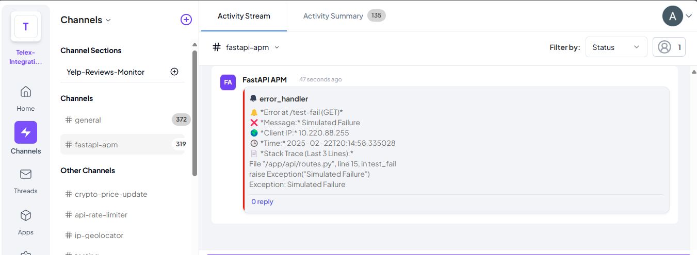

# FastAPI APM – Global Error Handler

## Overview

A lightweight, high-performance Application Performance Monitoring (APM) solution for FastAPI, designed to catch, log, and report errors in real-time to Telex. This integration ensures that unhandled exceptions are immediately logged and reported, facilitating faster debugging and improved system reliability.

## Features

- **Global Error Handling**: Captures unhandled exceptions across all FastAPI routes.
- **Real-time Reporting**: Sends instant notifications to Telex upon error occurrence.
- **Asynchronous Logging**: Utilizes background tasks for non-blocking error logging.
- **Detailed Error Information**: Logs comprehensive error details, including stack traces and request metadata.
- **Easy Deployment**: Docker and Nginx configurations for seamless production deployment.

## Project Structure

```bash
fastapi-apm/
├── .github/
│   └── workflows/
│       ├── deploy.yml              # GitHub Actions deployment configuration
│       └── keepalive.yml           # Keepalive Deployment configuration for Render
├── api/
│   ├── __init__.py
│   └── routes/
│       ├── __init__.py
│       ├── integration_config.py   # Integration configuration for Telex
│       └── routes.py               # Example route handlers to trigger error
├── apm/
│   ├── __init__.py
│   ├── background_worker.py        # Asynchronous error logging
│   └── error_handler.py            # Global error handler
├── core/
│   ├── __init__.py
│   └── config.py                   # Application configuration settings
├── nginx/
│   └── default.conf                # Nginx configuration file
├── .gitignore
├── Dockerfile                      # Docker image configuration
├── README.md
├── docker-compose.yml              # Docker Compose configuration
├── main.py                         # Application entry point
├── requirements.txt                # Python dependencies
├── start.sh                        # Startup script
└── vercel.json                     # Vercel deployment configuration
```

## Installation

1. **Clone the repository**:

   ```bash
   git clone https://github.com/telexintegrations/fastapi-apm.git
   cd fastapi-apm
   ```

2. **Create a virtual environment**:

   ```bash
   python -m venv venv
   source venv/bin/activate  # On Windows: venv\Scripts\activate
   ```

3. **Install dependencies**:

   ```bash
   pip install -r requirements.txt
   ```

## Configuration

1. **Set up environment variables**:

   Create a `.env` file in the root directory with the following content:

   ```ini
   TELEX_WEBHOOK_URL=https://ping.telex.im/v1/webhooks/YOUR-WEBHOOK-ID
   ```

   Replace `YOUR-WEBHOOK-ID` with your actual Telex webhook ID.

2. **Ensure log directory exists**:

   Before running the application, ensure that the `apm/logs` directory exists:

   ```bash
   mkdir -p apm/logs
   ```

## Running the Application

**Start the server**:

```bash
uvicorn main:app --host 0.0.0.0 --port 8000 --reload
```

## Testing

To trigger an error, you can send a GET request to <https://fastapi-apm.onrender.com/test-fail> and the error will be caught and get logged in the `fastapi-apm` channel on Telex test organization


## Deployment

### Using Docker and Docker Compose

1. **Build and run the container**:

   ```bash
   docker-compose up -d --build
   ```

2. **Check logs**:

   ```bash
   docker logs -f fastapi-apm
   ```

### Using Vercel

- Deploy the application to Vercel using the provided `vercel.json` configuration.

## API Endpoints

### Example Route to Trigger Errors

- `GET /test-fail` - Example endpoint

## Error Handling

The application includes a global error handler that:

- Catches unhandled exceptions across all routes.
- Logs error details asynchronously.
- Sends error notifications to the configured Telex channel.

## Contributing

1. **Fork the repository**.

2. **Create a feature branch**:

   ```bash
   git checkout -b feature/YourFeatureName
   ```

3. **Commit your changes**:

   ```bash
   git commit -m 'Add YourFeatureName'
   ```

4. **Push to the branch**:

   ```bash
   git push origin feature/YourFeatureName
   ```

5. **Open a Pull Request**.

## License

This project is licensed under the MIT License. See the [LICENSE](LICENSE) file for details.

## Support

For support, please open an issue in the GitHub repository.
